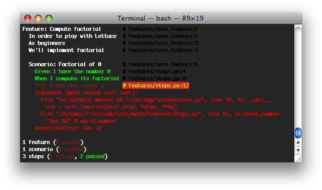
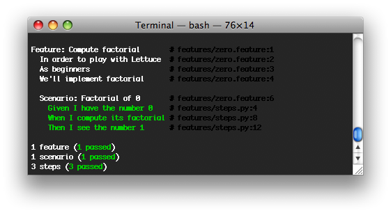
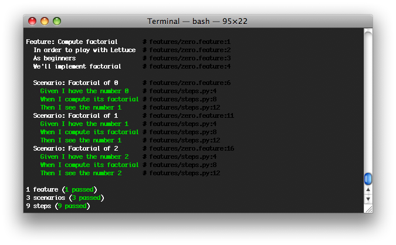
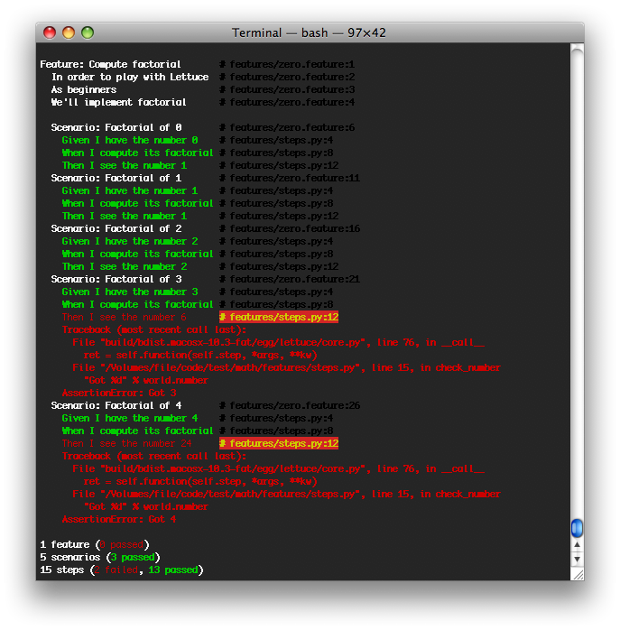
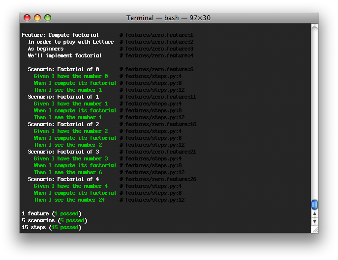

introduction
============

Lettuce\_ is an extremely useful and charming tool for BDD\_ (Behavior
Driven Development). It can execute plain-text functional descriptions
as automated tests for Python\_ projects, just as Cucumber\_ does for
Ruby\_.

Lettuce\_ makes the development and testing process really easy,
scalable, readable and - what is best - it allows someone who doesn't
program to describe the behavior of a certain system, without imagining
those descriptions will automatically test the system during its
development.

get lettuce
-----------

Make sure you've got Python installed and then run from the terminal:

    user@machine:~$ [sudo] pip install lettuce

define a problem
----------------

Let's choose a problem to lettuce: **Given a number, what is its
factorial?**

project structure
-----------------

Build the directory tree bellow such as the files `zero.feature` and
`steps.py` are empty.

    /home/user/projects/mymath
         | tests
               | features
                    - zero.feature
                    - steps.py

lettuce it!
-----------

Lets begin to describe and solve our problem...

### first round

#### [a] describe behaviour

Start describing the expected behaviour of factorial in `zero.feature`
using English:

    Feature: Compute factorial
        In order to play with Lettuce
        As beginners
        We'll implement factorial

        Scenario: Factorial of 0
            Given I have the number 0
            When I compute its factorial
            Then I see the number 1

#### [b] define steps in python

Now let's define the steps of the scenario, so Lettuce can understand
the behaviour description. Create the `steps.py` file which will contain
python code describing the steps.

Python:

    from lettuce import *

    @step('I have the number (\d+)')
    def have_the_number(step, number):
        world.number = int(number)

    @step('I compute its factorial')
    def compute_its_factorial(step):
        world.number = factorial(world.number)

    @step('I see the number (\d+)')
    def check_number(step, expected):
        expected = int(expected)
        assert world.number == expected, \
            "Got %d" % world.number

    def factorial(number):
        return -1

Ideally, factorial will be defined somewhere else. However, as this is
just a first example, we'll implement it inside steps.py, so you get the
idea of how to use Lettuce.

**Notice that, until now, we haven't defined the factorial function
(it's returning -1).**

#### [c] run and watch it fail

Go to the tests directory and run from the terminal:

    user@machine:~/projects/mymath/tests$ lettuce

As you haven't implemented factorial, it is no surprise the behavior
won't be reached:

Our only scenario failed :( Let's solve it...

#### [d] write code to make it pass

Well, by definition, we know that the factorial of 0 is 1. As our only
feature is this... we could force factorial to return 1.

    from lettuce import *

    @step('I have the number (\d+)')
    def have_the_number(step, number):
        world.number = int(number)

    @step('I compute its factorial')
    def compute_its_factorial(step):
        world.number = factorial(world.number)

    @step('I see the number (\d+)')
    def check_number(step, expected):
        expected = int(expected)
        assert world.number == expected, \
            "Got %d" % world.number

    def factorial(number):
        return 1

#### [e] run again and watch it pass

Again, run from the terminal:

    user@machine:~/projects/mymath/tests$ lettuce

And you'll be happy to see your factorial implementation passed all the
behaviours expected:

Great! :)

However, one test is not enough for checking the quality of our
solution... So let's lettuce it again!

### second round

Let's provide more tests so our problem is better described, and so we
provide a more accurate implementation of factorial:

#### [a] describe behaviour

Let's provide two new scenarios, for numbers 1 and 2:

    Feature: Compute factorial
      In order to play with Lettuce
      As beginners
      We'll implement factorial

      Scenario: Factorial of 0
        Given I have the number 0
        When I compute its factorial
        Then I see the number 1

      Scenario: Factorial of 1
        Given I have the number 1
        When I compute its factorial
        Then I see the number 1

      Scenario: Factorial of 2
        Given I have the number 2
        When I compute its factorial
        Then I see the number 2

#### [b] define steps in python

As we haven't changed the definition, no need to make changes on this
step.

#### [c] run and watch it fail

    user@machine:~/projects/mymath/tests$ lettuce

When running Lettuce we realize that our previous implementation of
factorial works fine both for 0 and for 1, but not for 2 - it fails. :(

#### [d] write code to make it pass

Let's provide a solution so we get the right factorial for all
scenarios, specially for number 2:

    from lettuce import *

    @step('I have the number (\d+)')
    def have_the_number(step, number):
        world.number = int(number)

    @step('I compute its factorial')
    def compute_its_factorial(step):
        world.number = factorial(world.number)

    @step('I see the number (\d+)')
    def check_number(step, expected):
        expected = int(expected)
        assert world.number == expected, \
            "Got %d" % world.number

    def factorial(number):
        number = int(number)
        if (number == 0) or (number == 1):
            return 1
        else:
            return number

#### [e] run again and watch it pass

    user@machine:~/projects/mymath/tests$ lettuce

Great! Three scenarios described and they are alright!

### third round

Let's provide more tests so our problem is better described and we get
new errors so we'll be able to solve them.

#### [a] describe behaviour

    Feature: Compute factorial
      In order to play with Lettuce
      As beginners
      We'll implement factorial

      Scenario: Factorial of 0
        Given I have the number 0
        When I compute its factorial
        Then I see the number 1

      Scenario: Factorial of 1
        Given I have the number 1
        When I compute its factorial
        Then I see the number 1

      Scenario: Factorial of 2
        Given I have the number 2
        When I compute its factorial
        Then I see the number 2

      Scenario: Factorial of 3
        Given I have the number 3
        When I compute its factorial
        Then I see the number 6

      Scenario: Factorial of 4
        Given I have the number 4
        When I compute its factorial
        Then I see the number 24

#### [b] define steps in python

As we haven't changed the definition, no need to make changes on this
step.

#### [c] run and watch it fail

    user@machine:~/projects/mymath/tests$ lettuce

#### [d] write code to make it pass

    from lettuce import *

    @step('I have the number (\d+)')
    def have_the_number(step, number):
        world.number = int(number)

    @step('I compute its factorial')
    def compute_its_factorial(step):
        world.number = factorial(world.number)

    @step('I see the number (\d+)')
    def check_number(step, expected):
        expected = int(expected)
        assert world.number == expected, \
            "Got %d" % world.number

    def factorial(number):
        number = int(number)
        if (number == 0) or (number == 1):
            return 1
        else:
            return number*factorial(number-1)

#### [e] run again and watch it pass

    user@machine:~/projects/mymath/tests$ lettuce

### forth round

All steps should be repeated as long as you can keep doing them - the
quality of your software depends on these.

Have a nice lettuce...! ;)
